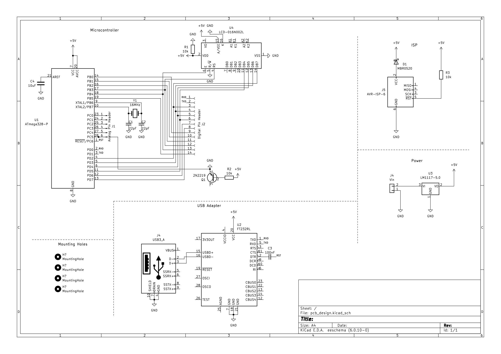

# Benedicta's Lab Notebook

## 2/20/23
While searching for parts, we discovered the Raspberry Pi we needed was sold out. As an alternative, we contacted the professor 
and TA of ECE 479 and received a Raspberry Pi 4 kit. 

Ordered some parts that we needed for the project.
* Parts ordered currently: 12VDC solenoid valve, DS18B20 temperature sensor probe, 128x64 oled display.
* (May switch to 16x2 LCD display as it's easier to connect to atmega328p)

Spoke to the machine shop for initial build ideas. 
* Will provide tub and valve when it arrives for the build of our encasement.

Started working on the PCB schematic.

* As of now, PCB will consist of atmega328p, LCD display and FTDI module for USB communication.
* potential questions: 
  * Should we use a transistor rather than relay?
    * Silent and don't need to worry about mounting
  * Should interfacing with FTDI module occur on pcb or separate?
    * FT23RL chip currently sold out on Digikey and Mouser, so we may have to use a separate FTDI module. If so how does it connect to the PCB?

Post TA meeting: 
    Feedback included adding more tolerance analysis and bounds to proposal and design document.