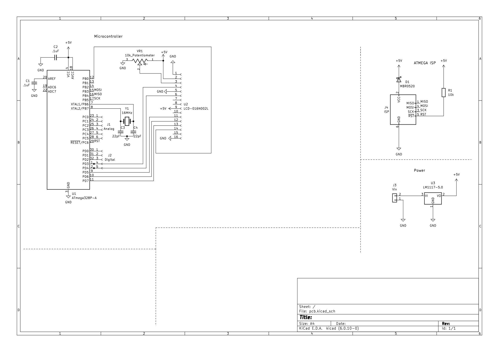
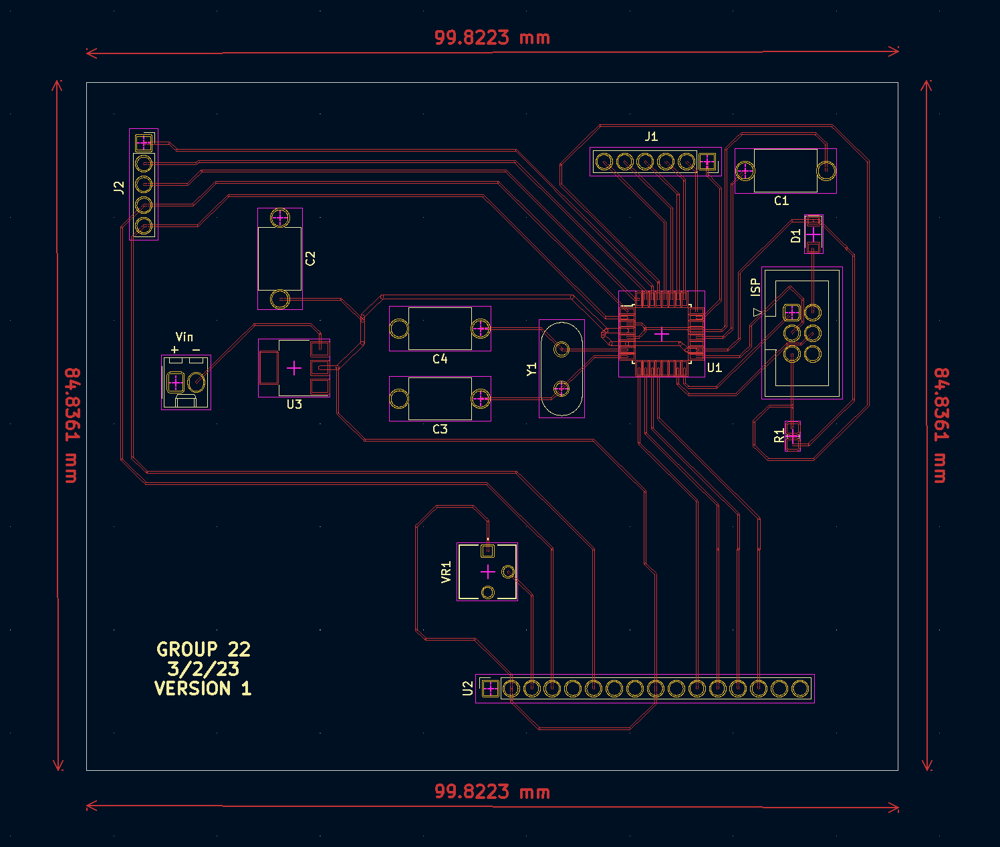

# Benedicta's Lab Notebook

## 2/20/23
While searching for parts, we discovered the Raspberry Pi we needed was sold out. As an alternative, we contacted the professor 
and TA of ECE 479 and received a Raspberry Pi 4 kit. 

Ordered some parts that we needed for the project.
* Parts ordered currently: 12VDC solenoid valve, DS18B20 temperature sensor probe, 128x64 oled display.
  * May switch to 16x2 LCD display as it's easier to connect to atmega328p

Spoke to the machine shop for initial build ideas. 
* Will provide tub and valve when it arrives for the build of our encasement.

Started working on the PCB schematic.

* As of now, PCB will consist of atmega328p, LCD display and FTDI module for USB communication.
* Potential questions: 
  * Should we use a transistor rather than relay?
    * Silent and don't need to worry about mounting
  * Should interfacing with FTDI module occur on pcb or separate?
    * FT23RL chip currently sold out on Digikey and Mouser, so we may have to use a separate FTDI module. If so how does it connect to the PCB?

Post TA meeting: 
    Feedback included adding more tolerance analysis and bounds to proposal and design document.

---
## 2/27/23
Spoke to machine shop again about frame build and provided them with valve and tub.

Finished variation 1 of PCB schematic. Will attend the PCB review session on 2/28/23 to get feedback.

While working on PCB design and schematic, I realized that the oled display we were planning on using was a little small and couldnt find the exact components on kicad - need to import a library. I decided to switch to a 16x2 lcd display instead.

I also decided to use a transistor instead of a relay to control the solenoid valve. This will allow us to control the valve without having to worry about mounting the relay. 

We are not in need of an FTDI module anymore as we can directly connect the atmega328p to the Raspberry Pi using the UART pins and will use ISP programming to program the atmega328p.

We are keeping most components off the PCB to keep it simple.

Variation 1 of PCB schematic:

---
## 3/6/23
Presented for Design Review. We received feedback on our use of a raspberry pi over a wifi module, but we have made progress on
our notification subsystem with the raspberry pi and were not made aware of the prolems with a raspberry pi until the Design Review occured and pcb routing had begun. We therefore decided to keep the raspberry pi in our design. 

I completed the PCB layout and routing and sent it to Prannoy for ordering. Passed the audit and requested a stencil.

(Long header is for display)

Our next step is to breadboard the prototype but we have faced issues with finding a breadboard friendly atmega328p. As we ordered multiple SMD atmega328p's, we will be using one of those for the prototype by soldering wires to the pins and attaching that to a breadboard.

Machine shop has finished the frame build and Neha will be picking it up on 3/10/23. 

---
## 3/13/23
Spring Break.

---