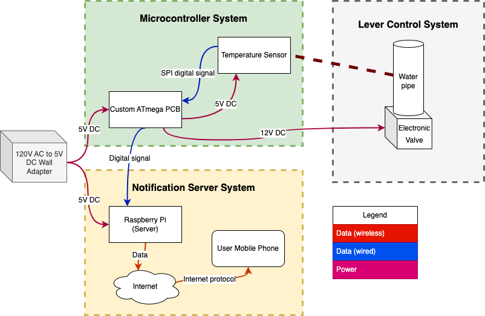
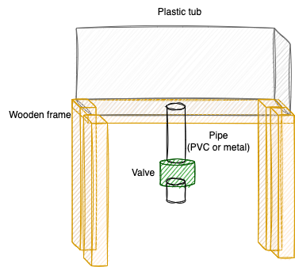

# Ethan's Lab Notebook

## 2/20/23
This past Friday, we met with Prannoy for our first weekly meeting. In this meeting, he gave us some feedback on our project proposal, for which I created a block diagram, and have attached the image below. His feedback primarily revolved around us needing to add more quantitative values and tolerances to the specifications of our project; otherwise, he said our project looked to be in good shape.

Additionally, earlier, Benedicta and I visited the machine shop in the ECE building and spoke with Gregg, the research lab shop supervisor. We explained to him our project and the general requirements for the structure that we would need to be constructed by the machine shop, by showing images and referring to a similar contraption already present in the machine shop. Below is the sketch that we initially brought forth, however, after our discussion with Gregg and what he thought was viable and practical, we anticipate having a bit of a different-looking setup.

We are currently in the process of designing our microcontroller PCB and composing the design document. Benedicta has already placed an order for some of our initial parts (valve, temperature sensor, LCD display), and Prannoy approved the order.

