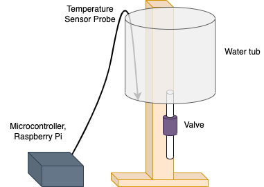

# Ethan's Lab Notebook

## 2/20/23
This past Friday, we met with Prannoy for our first weekly meeting. In this meeting, he gave us some feedback on our project proposal, for which I created a block diagram, and have attached the image below. His feedback primarily revolved around us needing to add more quantitative values and tolerances to the specifications of our project; otherwise, he said our project looked to be in good shape.

Additionally, earlier, Benedicta and I visited the machine shop in the ECE building and spoke with Gregg, the research lab shop supervisor. We explained to him our project and the general requirements for the structure that we would need to be constructed by the machine shop, by showing images and referring to a similar contraption already present in the machine shop. Below is the sketch that we initially brought forth, however, after our discussion with Gregg and what he thought was viable and practical, we anticipate having a bit of a different-looking setup.

We are currently in the process of designing our microcontroller PCB and composing the design document. Benedicta has already placed an order for some of our initial parts (valve, temperature sensor, LCD display), and Prannoy approved the order.

## 2/27/23
Last week, we wrote our Design Document and discussed it, along with other details of our project progress, with Prannoy during our weekly meeting. We also wrote our Team Contract and signed up for our Design Review and peer reviews.

Today we went back to the machine shop and met with Gregg again. We brought along the solenoid valve from the previous order which arrived, as well as the tub we plan to use for our setup. After discussion more further details with Gregg regarding our design and what we needed the machine shop to construct for us, we handed over the parts and he said we would be contacted once they finished building it, or if they had any further questions (though unlikely due to the simplicity of our setup). The revised setup is shown below.

Additionally, we went to the ECEB Electronics Services Shop with the list of PCB components we needed for our design, and picked out numerous capacitors and resistors of varying values. Then, we placed a second parts order for the remaining electronic components that we need for our PCB and circuit design, at least at this point in time.

Next, we plan to begin finalizing and checking our PCB design, as well as getting started on the Raspberry Pi programming.

